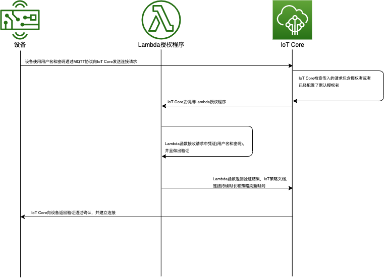

# AWS IoT自定义验证
有时候客户希望设备采用现有的自定义的验证机制，如用户名密码或者Token，AWS IoT Core可以和客户自定义的验证程序集成，通过IoT Core支持的MQTT，http和websocket协议进行连接。
设备通过MQTT协议，采用用户名密码进行连接的时序图如下：



## 前提条件

开发者机器:
* [AWS CDK](https://docs.aws.amazon.com/cdk/latest/guide/getting_started.html)
* [ASW CLI](https://docs.aws.amazon.com/cli/latest/userguide/cli-chap-install.html)

设备客户端:
* Node.js 12以上
* Python3.6以上
* jq (`sudo apt-get install jq`)

> **免责声明**：本解决方案仅用于演示目的，在没有对代码质量和安全性进行进一步研究的情况下，不应该在生产环境中原样使用。


## 通过CDK部署Lambda授权程序和需要的IAM角色
自定义授权器后端的Lambda授权程序是通过CDK部署的，你可以在`lib/jwt-iot-custom-authorizer-stack.ts`文件中检查将要创建的资源的定义。

运行下面的命令来下载所有项目的依赖项并编译CDK堆栈。:

```
npm install
npm run build
```

最后，你可以用以下方式部署:

```
cdk deploy
```

上述命令将打印出几行输出，其中有两个自定义的授权器lambda arn，一个叫做`lambdaArn`，另一个叫做`lambdaArnMqtt`。请记下这些，因为以后会需要它们。

你可以通过调用`cdk deploy'的参数来改变Mqtt授权器的用户名、密码和令牌的默认值。这些参数也是Lambda授权程序的环境变量。

```
cdk deploy --parameters username=user1 --parameters password=user1 --parameters token=XXX
```
##  MQTT用户名密码方式自定义授权配置

我们将设置一个自定义授权器，为MQTT/TLS连接执行用户名和密码验证。

### 采用AWS CLI执行

我们首先创建授权器(authorizer)，给它一个名字，并将其与执行授权的lambda函数联系起来。这个lambda函数已经由你部署的CDK栈创建。你可以在`lambda/iot-mqtt-custom-auth/lambda.js`中查看该代码。.

```bash
arn=<lambdaArnMqtt arn from CDK>

resp=$(aws iot create-authorizer \
  --authorizer-name "MqttAuthorizer" \
  --authorizer-function-arn $arn \
  --status ACTIVE \
  --signing-disabled)

auth_arn=$(echo $resp | jq -r .authorizerArn -)
```

以上我们设置MQTT授权器，不指定令牌，并禁用签名。。

注意授权器的arn，我们需要它来给AWS IoT服务提供权限，以便在提出新的连接请求时调用这个lambda函数。

```bash
aws lambda add-permission \
  --function-name  $arn \
  --principal iot.amazonaws.com \
  --statement-id Mqtt-auth \
  --action "lambda:InvokeFunction" \
  --source-arn $auth_arn
```

### 测试授权器

对于这个测试，我们提供一个使用Python AWS Crt库的Python客户端。
先获得IoT endpoint，可以执行：
```
aws iot describe-endpoint --endpoint-type iot:Data-ATS
```
然后执行Python客户端
```
pip3 install -r requirements.txt
python3 client/python/minimal-mqtt-client.py --username user1 --password user1 --topic d/user1 --endpoint <endpoint> --authorizer-name MqttAuthorizer
```
可以用下面的命令将授权者配置为账户的默认授权者。

```
aws iot set-default-authorizer --authorizer-name MqttAuthorizer
```

Python客户端关键代码如下:

```python
tls_options = io.TlsContextOptions()
tls_options.alpn_list = ['mqtt']

if args.root_ca:
    tls_options.override_default_trust_store_from_path(ca_dirpath=None,
        ca_filepath=args.root_ca)
tls_ctx = io.ClientTlsContext(options=tls_options)
client = mqtt.Client(client_bootstrap, tls_ctx)

username = args.username
if args.authorizer_name:
    username += f'?x-amz-customauthorizer-name={args.authorizer_name}'
if args.token:
    username += f'&token={args.token}'
mqtt_connection = mqtt.Connection(client=client,
    host_name=args.endpoint,
    port=443,
    on_connection_interrupted=on_connection_interrupted,
    on_connection_resumed=on_connection_resumed,
    client_id=args.client_id,
    clean_session=True,
    keep_alive_secs=6,
    username=username,
    password=args.password)

```